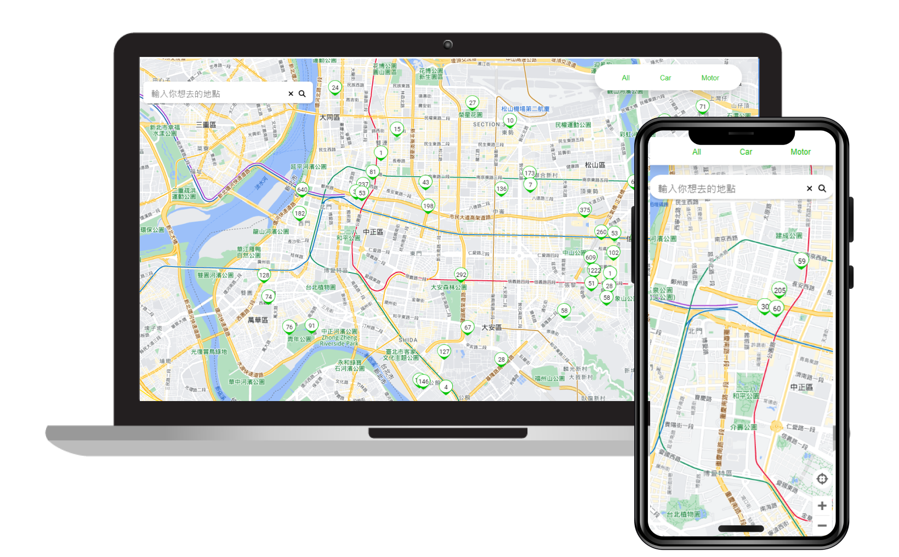

 

<h3>Taipei Parking Lot</h3>
<h3>The Taipei Park Lot for users who are driving and looking for parking lots in Taipei.<h3>
 

## Introduce
為身在台北的駕駛提供即時停車資料的網頁式app
- 可搜尋想去的地方並查看週遭的停車場
- 可透過右上點擊 All | car | motor 顯示對應載具空位之停車場
- 點擊圖標可查看即時停車剩餘空位及詳細資料
- 可點擊<b>開始導航</b>前往google map 導航至該地點
- 在此網頁app上同意定位時可查看自己當前位置
- 點擊右下 icon 可回到自己當前位置
